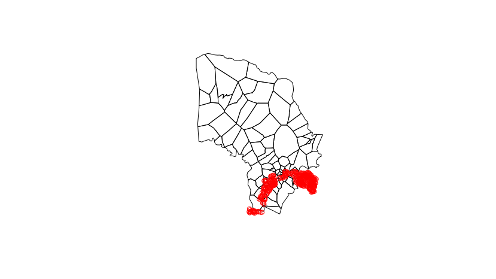

Map for Laia
================

## Instructions

1.  Download `TONGAT_POINTS.xlsx` into this directory.

2.  Download the Magude bairros shapefile from
    <https://github.com/joebrew/magude_bairros>.

3.  “Knit” this `.Rmd` follow in RStudio.

<!-- end list -->

``` r
# Libraries
library(tidyverse)
library(readxl)
library(sp)
library(raster)
library(rgdal)

# Read in the data
data <- read_excel('TONGAT_POINTS.xlsx')

# Make spatial
data_sp <- data
coordinates(data_sp) <- ~x+y

# Read in the Magude bairros shapefile
magude_bairros <- readOGR('magude_bairros', 'magude_bairros')
```

    OGR data source with driver: ESRI Shapefile 
    Source: "/home/joebrew/Documents/laiamap/magude_bairros", layer: "magude_bairros"
    with 91 features
    It has 6 fields

``` r
# Plot to ensure that it's working
plot(magude_bairros)

# Plot the points too
points(data_sp, col = 'red')
```

<!-- -->

``` r
# Get identical CRS
proj4string(data_sp) <- proj4string(magude_bairros)

# Extract the neighborhoods
neighborhoods <- extract(polygons(magude_bairros), data_sp)
data$bairro <- magude_bairros@data$barr_nm[neighborhoods$poly.ID]

# Write the data
write_csv(data, 'output.csv')
```
